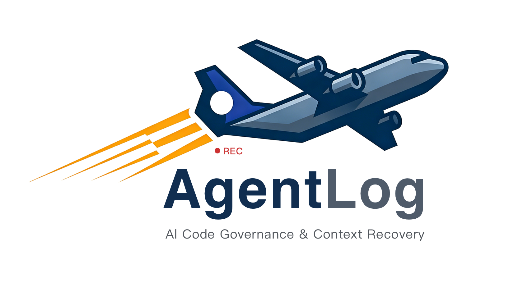

# AgentLog — AI 编程飞行记录仪



> AI 编程时代的「黑匣子」：自动捕获 Agent 交互日志，以 Trace/Span 模型组织任务时间线，支持人机混合接力与多 Agent 协作，并将一切与 Git Commit 精准绑定，一键导出周报或 PR 说明。

[](https://github.com/AgentLogLabs/agentlog)
[](./LICENSE)

---

## 📑 索引

[核心功能](#核心功能) · [快速开始](#快速开始) · [后台 API](#后台-api-一览) · [数据模型](#数据模型) · [Handoff & Stitching](#handoff--stitching-断点接管与人机混合接力) · [MCP 工具](#mcp-工具) · [配置项](#配置项) · [Git Worktree](#git-worktree-多-agent-并行支持) · [路线图](#路线图) · [FAQ](#常见问题faq) · [开发贡献](#开发贡献)

---

## 背景与痛点

国内开发者大量使用 Cursor、Cline 或基于 DeepSeek/Qwen API 的本地 Agent。代码虽然写得快，但过几天开发者自己都忘了当时 AI 为什么这么改，出了 Bug 无从下手。

**AgentLog** 解决的就是这个问题：在你与 AI 交互时，静默地在后台记录一切，并在你 `git commit` 时自动将这些记录与代码变更绑定。

---

## 核心功能

| 功能 | 说明 |
|------|------|
| 🎙️ **自动捕获** | 拦截发往 DeepSeek / Qwen / Kimi 等 API 的请求，提取 Prompt + Response |
| 🧠 **推理过程保存** | 专项支持 DeepSeek-R1 的 `<think>` 推理链，完整存储中间思考步骤 |
| 🔗 **Git Commit 绑定** | 通过 post-commit 钩子，自动将每次提交与相关 AI 会话关联 |
| 🌿 **Git Worktree 支持** | 多个 AI Agent 可以同时在不同 worktree 上并行工作，各自会话精准绑定到对应 Commit，互不干扰 |
| 📊 **侧边栏面板** | VS Code 侧边栏显示会话列表、Commit 绑定关系、统计数据 |
| 📝 **一键导出** | 支持导出为中文周报、PR/Code Review 说明、JSONL 原始数据、CSV 表格 |
| 🏠 **本地优先** | 所有数据存储在本机 SQLite（`~/.agentlog/agentlog.db`），完全离线可用 |
| 🔄 **断点接管 (Handoff)** | Agent 出错时自动生成 Error Span，人类或其他 Agent 可一键认领并无缝接力 |
| 🧵 **Trace/Span 模型** | 完整的 Trace 时间线视图，支持多 Agent 混合协作、上下文缝合 |
| 🤖 **多 Agent 协作** | 支持 OpenCode、Cursor、Claude Code、Cline 等 Agent 通过 sessions.json 接力协作 |

---

## 支持的模型与工具

### 国内主流模型

| 模型 | 提供商 | 说明 |
|------|--------|------|
| DeepSeek-V3 / R1 | DeepSeek | 完整支持推理链捕获 |
| 通义千问 Qwen-Max / Plus | 阿里云 DashScope | OpenAI 兼容模式 |
| Kimi / Moonshot | 月之暗面 | OpenAI 兼容模式 |
| 豆包 | 字节跳动 Ark | OpenAI 兼容模式 |
| ChatGLM | 智谱 AI | OpenAI 兼容模式 |
| 本地模型 | Ollama / LM Studio | 本地 HTTP 接口 |

### 支持的 AI 编程工具

- **Cline**（VS Code 插件）
- **Cursor**（IDE 内置 AI）
- **Continue**（VS Code 插件）
- **直接 API 调用**（通过 HTTP 拦截）

---

## 技术栈

| 层次 | 技术 |
|------|------|
| Monorepo | pnpm workspaces |
| 语言 | TypeScript 5.x（全栈） |
| 后台框架 | Fastify 4.x |
| 数据库 | SQLite via `better-sqlite3`（WAL 模式） |
| Git 集成 | `simple-git` |
| VS Code API | `@types/vscode ^1.85` |
| 拦截机制 | Node.js `http/https` Monkey-patch |
| ID 生成 | `nanoid` |

---

## 快速开始

```bash
# 克隆并安装依赖
git clone https://github.com/AgentLogLabs/agentlog.git && cd agentlog && pnpm install

# 构建全部
pnpm build

# 启动后台开发服务
pnpm dev

# 在 VS Code 中按 F5 调试扩展
```

---

## 后台 API 一览

后台默认运行在 `http://localhost:7892`，可通过环境变量 `AGENTLOG_PORT` 覆盖。

### 会话接口

| 方法 | 路径 | 说明 |
|------|------|------|
| `POST` | `/api/sessions` | 上报新会话 |
| `GET` | `/api/sessions` | 分页查询（支持多维过滤） |
| `GET` | `/api/sessions/stats` | 统计数据 |
| `GET` | `/api/sessions/unbound` | 查询未绑定 Commit 的会话 |
| `GET` | `/api/sessions/:id` | 获取单条会话详情 |
| `PATCH` | `/api/sessions/:id/tags` | 更新标签 |
| `PATCH` | `/api/sessions/:id/note` | 更新备注 |
| `PATCH` | `/api/sessions/:id/commit` | 手动绑定/解绑 Commit |
| `DELETE` | `/api/sessions/:id` | 删除会话 |

### Commit 绑定接口

| 方法 | 路径 | 说明 |
|------|------|------|
| `POST` | `/api/commits/hook` | Git post-commit 钩子接收端 |
| `POST` | `/api/commits/bind` | 手动批量绑定 |
| `DELETE` | `/api/commits/unbind/:sessionId` | 解绑 |
| `GET` | `/api/commits` | 列出所有绑定记录 |
| `GET` | `/api/commits/:hash` | 查询指定 Commit 的绑定信息 |
| `GET` | `/api/commits/:hash/sessions` | 获取 Commit 关联的所有会话 |
| `GET` | `/api/commits/:hash/context` | 生成 Commit 的 AI 交互上下文文档（Query 传参） |
| `POST` | `/api/commits/:hash/context` | 生成 Commit 的 AI 交互上下文文档（Body 传参） |
| `GET` | `/api/commits/:hash/explain` | 生成 Commit 的 AI 交互解释摘要（Query 传参） |
| `POST` | `/api/commits/:hash/explain` | 生成 Commit 的 AI 交互解释摘要（Body 传参） |
| `POST` | `/api/commits/hook/install` | 注入 Git 钩子 |
| `DELETE` | `/api/commits/hook/remove` | 移除 Git 钩子 |

### 导出接口

| 方法 | 路径 | 说明 |
|------|------|------|
| `GET` | `/api/export/formats` | 获取支持的导出格式列表 |
| `POST` | `/api/export` | 生成导出内容 |
| `POST` | `/api/export/preview` | 预览（前 50 行） |

### Handoff & Trace 接口

| 方法 | 路径 | 说明 |
|------|------|------|
| `GET` | `/api/traces` | 查询 Trace 列表（支持分页和状态过滤） |
| `GET` | `/api/traces/pending` | 查询待认领的 Trace 列表 |
| `GET` | `/api/traces/:id` | 获取单个 Trace 详情 |
| `GET` | `/api/traces/:id/spans` | 获取 Trace 下所有 Span（时间线） |
| `GET` | `/api/traces/:id/summary` | 获取 Trace 摘要 |
| `GET` | `/api/traces/:id/diff` | 获取 Trace 变更文件 Diff |
| `POST` | `/api/traces` | 创建新 Trace |
| `PATCH` | `/api/traces/:id` | 更新 Trace（状态或任务目标） |
| `DELETE` | `/api/traces/:id` | 删除 Trace |
| `POST` | `/api/traces/:id/handoff` | 创建 Trace 接力（转为 pending_handoff 状态） |
| `POST` | `/api/traces/:id/resume` | Agent 认领 Trace |
| `POST` | `/api/traces/:id/pause` | 暂停 Trace |
| `POST` | `/api/traces/:id/resume-from-pause` | 从暂停恢复 Trace |
| `POST` | `/api/traces/:id/complete` | 标记 Trace 为完成 |
| `POST` | `/api/traces/:id/associate-commits` | 批量关联历史 commits 到 Trace |
| `GET` | `/api/sessions/active` | 获取当前活跃的 Session |

---

## 数据模型

### AgentSession（AI 交互会话）

```typescript
interface AgentSession {
  id: string;              // nanoid
  createdAt: string;       // ISO 8601
  provider: ModelProvider; // 'deepseek' | 'qwen' | 'kimi' | ...
  model: string;           // 实际模型名，例如 "deepseek-r1"
  source: AgentSource;     // 'cline' | 'cursor' | 'continue' | ...
  workspacePath: string;   // 工作区绝对路径（多 worktree 场景下为各 worktree 路径）
  gitRepoRoot?: string;    // Git 仓库根目录（多 worktree 共享，用于跨 worktree 绑定）
  prompt: string;          // 用户输入的完整 Prompt
  reasoning?: string;      // AI 推理过程（DeepSeek-R1 的 <think> 内容）
  response: string;        // AI 最终回复
  commitHash?: string;     // 绑定的 Git Commit SHA
  affectedFiles: string[]; // 涉及的文件列表
  durationMs: number;      // 交互耗时（毫秒）
  tags?: string[];         // 用户标签
  note?: string;           // 用户备注
  metadata?: Record<string, unknown>; // 扩展字段
}
```

### CommitBinding（Commit 绑定）

```typescript
interface CommitBinding {
  commitHash: string;      // Git 完整 SHA-1
  sessionIds: string[];    // 关联的会话 ID 列表
  message: string;         // Commit message
  committedAt: string;     // 提交时间
  authorName: string;      // 提交者
  authorEmail: string;
  changedFiles: string[];  // 变更文件列表
  workspacePath: string;
}
```

### Commit 上下文与解释

通过 `/api/commits/:hash/context` 和 `/api/commits/:hash/explain` 接口，可以将指定 Commit 关联的所有 AI 交互记录汇总为结构化文档，直接用于新 AI 对话的上下文注入。

**Context（上下文文档）**支持 Markdown / JSON / XML 三种格式输出，可通过以下选项控制内容：

| 选项 | 类型 | 默认值 | 说明 |
|------|------|--------|------|
| `format` | `'markdown' \| 'json' \| 'xml'` | `'markdown'` | 输出格式 |
| `language` | `'zh' \| 'en'` | `'zh'` | 输出语言 |
| `includePrompts` | `boolean` | `true` | 是否包含用户 Prompt |
| `includeResponses` | `boolean` | `true` | 是否包含模型 Response |
| `includeReasoning` | `boolean` | `true` | 是否包含推理过程 |
| `includeChangedFiles` | `boolean` | `true` | 是否包含变更文件列表 |
| `maxContentLength` | `number` | `2000` | 单条内容最大字符数（0 = 不截断） |
| `maxSessions` | `number` | `0` | 最多包含的会话数量（0 = 不限制） |

**Explain（解释摘要）**输出 Markdown 格式，包含总体概述、逐条会话要点（用户意图 / AI 回应 / 是否包含推理）以及涉及文件汇总。

### Trace（任务追踪）

Trace 是 AgentLog 的核心任务追踪单元，将多次 AI 交互（Span）组织成完整的时间线，支持人机混合协作和断点接力。

```typescript
interface Trace {
  id: string;              // 唯一标识（如 "A-999"）
  status: TraceStatus;     // 'running' | 'pending_handoff' | 'in_progress' | 'completed' | 'failed' | 'paused'
  title?: string;          // 任务标题
  description?: string;    // 任务描述
  createdAt: string;       // ISO 8601
  updatedAt: string;       // ISO 8601
  workspacePath: string;   // 工作区路径
  gitRepoRoot?: string;    // Git 仓库根目录
  parentTraceId?: string;  // 父 Trace ID（Fork 场景）
  metadata?: Record<string, unknown>;
}
```

### Span（交互事件）

Span 是 Trace 时间线上的单个事件节点，记录一次完整的 AI 交互或错误状态。

```typescript
interface Span {
  id: string;              // ULID 唯一标识
  traceId: string;         // 所属 Trace ID
  parentSpanId?: string;   // 父 Span ID（嵌套场景）
  actorType: string;       // 'user' | 'assistant' | 'tool' | 'error' | 'human'
  actorName: string;       // 参与者名称（如 "opencode", "Builder-Agent"）
  payload: Record<string, unknown>; // 事件载荷（content、tool_name、errorType 等）
  createdAt: string;       // ISO 8601
  durationMs?: number;     // 耗时（毫秒）
  tokenUsage?: TokenUsage; // Token 消耗
}
```

### Error Span（错误事件）

当 Agent 遇到错误时，自动生成的 Error Span 包含完整的错误上下文，用于断点接力。

```typescript
interface ErrorSpanPayload {
  errorType: string;           // 错误类型（如 "DeadlockError"）
  stackTrace: string;          // 堆栈信息
  memorySnapshot?: {           // 内存快照
    workspacePath: string;
    changedFiles: string[];
    gitStatus?: GitStatus;
  };
  diff?: {                     // 变更统计
    changedFiles: FileDiffStats[];
    totalAdditions: number;
    totalDeletions: number;
  };
  reasoningChain?: ReasoningChainStep[]; // 连续推理过程
}
```

### sessions.json（接力协调文件）

文件位置：`.git/agentlog/sessions.json`

用于多 Agent 接力协作的协调文件，记录待认领的 Trace 和当前活跃的 Session。

```json
{
  "pending": {
    "A-999": {
      "createdAt": "2026-04-05T09:50:00Z",
      "targetAgent": "opencode"
    },
    "B-888": {
      "createdAt": "2026-04-05T10:00:00Z",
      "targetAgent": "cursor"
    }
  },
  "active": {
    "session-uuid-1": {
      "traceId": "A-999",
      "agentType": "opencode",
      "status": "active",
      "startedAt": "2026-04-05T10:00:00Z",
      "worktree": "/path/to/main"
    }
  }
}
```

| 字段 | 说明 |
|------|------|
| `pending` | 待认领的 Trace，key 为 TraceId |
| `pending[].targetAgent` | 目标 Agent 类型（opencode/cursor/claude-code 等） |
| `pending[].createdAt` | 创建时间 |
| `active` | 当前活跃的 Session，key 为 SessionUuid |
| `active[].traceId` | 该 Session 正在处理的 Trace |
| `active[].agentType` | Agent 类型 |
| `active[].status` | 状态（always active） |
| `active[].worktree` | Git worktree 路径 |

### Agent 启动时自动认领 Trace

OpenCode/Cursor/Claude Code 等 Agent 启动时，MCP Client 会检查 `.git/agentlog/sessions.json` 并自动认领匹配的 pending trace：

```typescript
// MCP Client 初始化时检查并认领 Trace
async function checkAndClaimTrace() {
  const sessionsFile = path.join(process.cwd(), '.git/agentlog/sessions.json');
  if (!fs.existsSync(sessionsFile)) return;

  const sessions = JSON.parse(fs.readFileSync(sessionsFile, 'utf-8'));
  const agentType = detectAgentType(); // opencode / cursor / claude-code

  for (const [traceId, pending] of Object.entries(sessions.pending)) {
    if (pending.targetAgent === agentType) {
      // 认领该 Trace
      delete sessions.pending[traceId];
      sessions.active[generateSessionId()] = {
        traceId,
        agentType,
        status: 'active',
        startedAt: new Date().toISOString()
      };
      fs.writeFileSync(sessionsFile, JSON.stringify(sessions, null, 2));
      process.env.AGENTLOG_TRACE_ID = traceId;
      break;
    }
  }
}
```

### AgentSwarm Agent 接收 Trace ID

Agent 可通过两种方式获取 Trace ID：

```typescript
// 消息处理函数
async function handleMessage(message: string) {
  let traceId: string | null = null;

  // 方式1: 直接提取 Trace ID
  const match = message.match(/Trace[:\s]+([A-Z0-9]+)/i);
  if (match) {
    traceId = match[1];
  } else {
    // 方式2: 语义搜索
    const results = await query_historical_interaction({
      keyword: message,
      status: 'in_progress',
      page_size: 5
    });
    if (results.data.length > 0) {
      traceId = results.data[0].trace.id;
    }
  }

  if (traceId) {
    execSync(`git config agentlog.traceId "${traceId}"`);
    process.env.AGENTLOG_TRACE_ID = traceId;
  }
}
```

**设计原则**：每种 Agent 只关心自己类型的 pending 项，互不干扰，具备良好扩展性。

---

## Handoff & Stitching：断点接管与人机混合接力

解决痛点：AI Agent 报错卡死，人类接手时"一脸懵逼"，只能去翻长达几千行的聊天记录，且修复后 Git Commit 割裂。

### 场景还原

1. **自动驾驶碰壁**：周五下午，开发者启动了 OpenClaw 的 Builder Agent 负责重构支付网关。Agent 跑了 20 分钟，改了 15 个文件，但在对接第三方 Stripe 接口时遇到死锁报错，尝试 3 次修复失败后主动抛出异常（Panic）。
2. **生成 Trace Ticket**：AgentLog 自动介入，生成了一个包含内存快照、变更 Diff、连续推理过程的 Error Span（Span ID: 101），归属在重构任务的 Trace ID: A-999 下。
3. **人类携重武器入场**：开发者收到通知，打开 VS Code/Cursor，通过 AgentLog 插件一键点击 "Resume Ticket #101"。AgentLog 瞬间将之前 Builder Agent 的核心决策逻辑和死锁原因作为 Context 注入到对话框中。
4. **修复与无缝缝合**：开发者在 Cursor 中与 AI 协同，花了 5 分钟手动修复了死锁问题，并执行 `git commit -m "fix: resolve stripe deadlock"`。
5. **黑匣子归档**：Git Hook 触发，系统自动将 Span ID 101（Agent 的努力与失败）+ Span ID 102（人类与 Cursor 的修复过程）+ 最终的 Git Commit Hash 完美缝合在 Trace ID A-999 的时间线上。

> **产品价值**：实现了真正的"上下文不掉线"。代码有出处，接盘无痛苦。

### 核心流程概览

完整链路涉及三个角色：
1. AgentSwarm Agent（OpenClaw Builder）
2. 人类（通过 VS Code/OpenCode/Cursor 等工具）
3. AgentSwarm Agent（继续完成工作）

> **注解**：AgentSwarm 当前的实现是 OpenClaw 下部署的多个 Agent 组成的系统。

### Trace 状态机

```
┌──────────────┐
│   running    │
└──────┬───────┘
       │
           Error / 认领 ↓
       │
┌──────▼───────┐
│pending_handoff│
└──────┬───────┘
       │
       │ commit + 选择"完成" → completed
       │ commit + 选择"继续修改" → in_progress
       ↓
┌──────────────┐
│ in_progress  │
└──────┬───────┘
       │
       commit ↓
       ↓
┌──────────────┐
│  completed   │
└──────────────┘
```

> **用户手动暂停**：`running` / `in_progress` → `paused` → 恢复 → `running`

| 状态 | 说明 |
|------|------|
| `running` | 进行中 |
| `pending_handoff` | 等待交接（Agent 出错或等待认领） |
| `in_progress` | 进行中（人类选择继续修改） |
| `completed` | 已完成 |
| `paused` | 已暂停（用户主动暂停，可随时恢复） |
| `failed` | 失败 |

### Git Hook post-commit 自动绑定

每次 `git commit` 时，AgentLog 通过 post-commit 钩子自动完成以下流程：

1. **读取 sessions.json**：优先获取当前活跃的 Session 及其关联的 Trace
2. **回退到 git config**：若无 active session，读取 `git config agentlog.traceId`
3. **兜底创建 human-direct Trace**：若仍未找到，自动生成 `human-direct-{timestamp}`
4. **调用 API 绑定 commit**：将 commit hash 与 Trace 建立关联

```bash
#!/bin/bash
# .git/hooks/post-commit
# AgentLog 自动绑定脚本

AGENTLOG_DIR=".git/agentlog"
SESSIONS_FILE="$AGENTLOG_DIR/sessions.json"
TRACE_ID=""
SESSION_ID=""

# 1. 优先读取 sessions.json 中的 active session
if [ -f "$SESSIONS_FILE" ]; then
  ACTIVE=$(jq -r ".active[] | select(.status==\"active\")" "$SESSIONS_FILE" 2>/dev/null)
  if [ -n "$ACTIVE" ]; then
    SESSION_ID=$(echo "$ACTIVE" | jq -r '.sessionId')
    TRACE_ID=$(echo "$ACTIVE" | jq -r '.traceId')
    # 清理 sessions.json
    jq "del(.active[\"$SESSION_ID\"])" "$SESSIONS_FILE" > "$SESSIONS_FILE.tmp"
    mv "$SESSIONS_FILE.tmp" "$SESSIONS_FILE"
  fi
fi

# 2. 如果没有 active session，读取 git config
if [ -z "$TRACE_ID" ]; then
  TRACE_ID=$(git config agentlog.traceId)
fi

# 3. 如果还是没有，创建 human-direct Trace
if [ -z "$TRACE_ID" ]; then
  TRACE_ID="human-direct-$(date +%s)"
fi

# 4. 调用 API 绑定 commit
curl -s -X POST "$AGENTLOG_GATEWAY/api/commit-bind" \
  -d "{\"traceId\": \"$TRACE_ID\", \"commitHash\": \"$GIT_COMMIT_HASH\"}" > /dev/null
```

### 多 Agent 接力机制

通过 `.git/agentlog/sessions.json` 协调文件实现多 Agent 接力：

```
右键 Trace A-999 → Resume with...
├── 🤖 OpenCode
├── 🎯 Cursor
├── 🧠 Claude Code
└── 📋 Other Agent...
```

| Agent 类型 | 启动时检查 | 认领条件 |
|-----------|-----------|----------|
| OpenCode | 读取 `pending[].targetAgent` | === opencode |
| Cursor | 读取 `pending[].targetAgent` | === cursor |
| Claude Code | 读取 `pending[].targetAgent` | === claude-code |

**设计原则**：每种 Agent 只关心自己类型的 pending 项，互不干扰，具备良好扩展性。

### 设计决策总结

| 决策 | 选择 | 理由 |
|------|------|------|
| Trace 管理 | `.git/agentlog/sessions.json` | 利用 Git 工作树特性，支持多 worktree |
| Session 模式 | 单一 Trace | 简化实现 |
| 多 Agent 支持 | targetAgent 字段 | 良好扩展性 |
| 纯人类 commit | 记录（human-direct） | 审计功能需要 |
| 任务完成判断 | 人类决定 | commit 后由人类选择 |
| Agent 获取 Trace | 直接 ID + 语义查询 | 灵活适应不同场景 |

### VS Code 接力命令

| 命令 | 说明 |
|------|------|
| `AgentLog: Create Handoff` | 创建接力 - 选择目标 Agent（Human/OpenCode/Cursor/Claude Code/Cline） |
| `AgentLog: Resume Trace With` | 认领待接力的 Trace |
| `AgentLog: Pause Trace` | 暂停当前 Trace |
| `AgentLog: Resume From Pause` | 从暂停恢复 |
| `AgentLog: Complete Trace` | 标记 Trace 为完成 |
| `AgentLog: Delete Trace` | 删除 Trace |
| `AgentLog: Copy Trace Context` | 复制 Trace 上下文到剪贴板（用于 handoff） |

### Error Span 自动检测

当 Agent 在工具调用中遇到错误时，MCP `log_turn` 会自动检测并创建 Error Span：
- 提取 `errorType`、`stackTrace`
- 自动构建 `reasoningChain`（从历史 Span 中提取推理链）
- 返回 handoff 提示，建议创建接力任务

### Error Span 完整格式

Agent 遇到错误时生成的 Error Span 包含完整的错误上下文，用于断点接力：

```json
{
  "id": "span-101",
  "traceId": "A-999",
  "parentSpanId": null,
  "actorType": "error",
  "actorName": "Builder-Agent",
  "payload": {
    "errorType": "DeadlockError",
    "stackTrace": "at StripeClient.connect (...)",
    "memorySnapshot": {
      "workspacePath": "/path/to/project",
      "currentFiles": ["src/stripe.ts", "src/payment.ts"],
      "gitStatus": "modified"
    },
    "diff": {
      "changedFiles": ["src/stripe.ts", "src/payment.ts"],
      "additions": 150,
      "deletions": 30
    },
    "reasoningChain": [
      {"step": 1, "thought": "分析Stripe API...", "action": "修改stripe.ts"},
      {"step": 2, "thought": "检测到死锁...", "action": "尝试修复#1"},
      {"step": 3, "thought": "修复失败...", "action": "尝试修复#2"},
      {"step": 4, "thought": "再次失败...", "action": "尝试修复#3"},
      {"step": 5, "thought": "三次失败...", "action": "抛出Panic"}
    ]
  },
  "createdAt": "2026-04-05T10:30:00Z"
}
```

| 字段 | 说明 |
|------|------|
| `actorType: "error"` | 标识这是一个错误 Span |
| `payload.errorType` | 错误类型（如 DeadlockError） |
| `payload.stackTrace` | 堆栈信息 |
| `payload.memorySnapshot` | 内存快照（workspacePath、当前文件） |
| `payload.diff` | 变更文件列表及统计 |
| `payload.reasoningChain` | 连续推理过程 |

---

## MCP 工具

AgentLog 提供以下 MCP 工具供 AI Agent 调用：

| 工具 | 说明 |
|------|------|
| `log_turn` | 记录一轮交互（user/assistant/tool），自动绑定 Git commit |
| `log_intent` | 归档任务意图和受影响的文件 |
| `claim_pending_trace` | 认领待处理的 Trace（从 sessions.json 读取并认领匹配 targetAgent 的 pending trace） |
| `query_traces` | 查询 Trace 列表（语义检索）或直接获取单个 Trace 详情 |
| `query_historical_interaction` | 查询历史 AI 交互记录，支持按文件名、关键词、commit hash 等维度搜索 |

---

## 配置项

在 VS Code 设置（`settings.json`）中，所有配置项以 `agentlog.` 为前缀：

| 配置项 | 默认值 | 说明 |
|--------|--------|------|
| `backendUrl` | `http://localhost:7892` | 后台服务地址 |
| `autoCapture` | `true` | 是否自动捕获 AI 交互 |
| `captureReasoning` | `true` | 是否捕获推理过程 |
| `autoBindOnCommit` | `true` | commit 时自动绑定最近未绑定的会话 |
| `retentionDays` | `90` | 数据保留天数（0 = 永久） |
| `autoStartBackend` | `true` | VS Code 启动时自动启动后台 |
| `debug` | `false` | 开启调试日志 |
| `exportLanguage` | `zh` | 导出语言（`zh` / `en`） |
| `interceptors.cline` | `true` | 是否捕获 Cline 的请求 |
| `interceptors.cursor` | `true` | 是否捕获 Cursor 的请求 |

---

## Git Worktree 多 Agent 并行支持

AgentLog 完整支持 `git worktree` 场景，多个 AI Agent 可以同时在同一仓库的不同 worktree 上独立工作，所有会话记录精准绑定到各自的 Commit，互不干扰。

### 工作原理

```
主仓库                     Worktree A               Worktree B
my-repo/                   my-repo-feat-login/       my-repo-fix-bug/
  .git/                      (共享同一 .git)           (共享同一 .git)
  src/                       src/                     src/
    ...                        ...                      ...

Agent-1 在此工作            Agent-2 在此工作          Agent-3 在此工作
→ session.workspacePath     → session.workspacePath   → session.workspacePath
  = "my-repo"                 = "my-repo-feat-login"    = "my-repo-fix-bug"
→ session.gitRepoRoot       → session.gitRepoRoot     → session.gitRepoRoot
  = "my-repo"                 = "my-repo"               = "my-repo"
```

**关键改进（Schema v4）**：

1. **`gitRepoRoot` 字段**：`agent_sessions` 表新增此字段，存储 Git 仓库根目录路径。无论会话发生在哪个 worktree，同一仓库下的所有会话共享相同的 `gitRepoRoot`。

2. **动态钩子脚本**：post-commit 钩子不再硬编码工作区路径，改为通过 `git rev-parse --show-toplevel` 在运行时动态获取当前 worktree 的真实路径，一次安装，所有 worktree 均生效。

3. **三级匹配策略**：post-commit 触发时，后端按以下顺序查找未绑定会话：
   - **Level 1（精确）**：按当前 worktree 的 `workspace_path` 精确匹配
   - **Level 2（跨 worktree）**：按 `git_repo_root` 匹配同仓库其他 worktree 的会话
   - **Level 3（兜底）**：生成自动摘要 Session（原有逻辑）

4. **会话自动推断**：创建 Session 时后端自动通过 `git rev-parse --show-toplevel` 填充 `gitRepoRoot`，Agent 无需手动传入。

### 使用方式

只需在**任意一个** worktree（通常是主仓库）安装 Git 钩子，所有 worktree 均自动支持：

```bash
# 在 VS Code 中执行命令：AgentLog: Install Git Hook
# 或通过 API：
curl -X POST http://localhost:7892/api/commits/hook/install \
  -H "Content-Type: application/json" \
  -d '{"workspacePath": "/path/to/my-repo"}'
```

---

## 隐私与安全

- **所有数据均存储在本机**，默认路径 `~/.agentlog/agentlog.db`
- 后台服务仅监听 `127.0.0.1`，不对外网暴露
- CORS 策略仅允许 `localhost` 和 VS Code Webview 来源
- 不收集任何遥测数据，不联网上报

---

## 路线图

### MVP（当前）

- [x] 基础脚手架（monorepo + 类型定义 + 后台 + 插件）
- [x] SQLite 数据库 + 迁移系统
- [x] REST API（会话 CRUD + 导出 + Commit 绑定）
- [x] HTTP 拦截器（支持流式 SSE 响应）
- [x] VS Code 侧边栏 TreeView
- [x] 会话详情 Webview + 仪表板
- [x] Git post-commit 钩子注入
- [x] 中文周报 / PR 说明导出

### 已完成

- [x] Commit 上下文文档生成（Markdown / JSON / XML）
- [x] Commit AI 交互解释摘要生成
- [x] Context & Explain REST API（GET/POST）
- [x] 中英文国际化支持
- [x] 内容截断 / 会话数量限制等精细控制选项
- [x] **Git Worktree 多 Agent 并行支持**（多个 AI Agent 同时在不同 worktree 上工作，各自会话精准绑定，不互相干扰）
- [x] **Trace/Span 核心模型**（完整的任务追踪体系，支持时间线视图、多 Agent 混合协作）
- [x] **Handoff & Stitching 断点接力**（Agent 出错自动生成 Error Span，人类/其他 Agent 一键认领无缝接力）
- [x] **sessions.json 协调机制**（基于 Git 工作树的 pending/active 会话管理，支持多 worktree 共享）
- [x] **Trace 状态机**（running → pending_handoff → in_progress → completed，支持 pause/resume）
- [x] **Error Span 自动检测**（MCP log_turn 自动检测工具调用错误，生成包含推理链的 Error Span）
- [x] **多 Agent 接力支持**（OpenCode/Cursor/Claude Code 通过 targetAgent 字段认领待处理 Trace）
- [x] **VS Code 接力命令**（Create Handoff、Resume Trace、Pause/Complete/Delete Trace）
- [x] **OpenClaw Agent Skill**（Agent 启动时自动检查并认领匹配的 pending trace）

### 后续计划

- [ ] 将上下文文档无缝注入新 AI 对话（粘贴到 Cline / Cursor / Continue 对话框）
- [ ] Context & Explain 单元测试与集成测试
- [ ] Webview 仪表板 UI 完善（React + VS Code UI Toolkit）
- [ ] 支持 Cline 扩展的 API 调用深度集成
- [ ] 基于 AI 的会话自动打标签（bugfix / 重构 / 新功能）
- [ ] 数据可视化（按模型 / 按时间的 AI 使用量统计）
- [ ] 支持团队协作（共享导出、代码审查集成）
- [ ] 本地向量化搜索（语义检索历史 Prompt）

---

## 常见问题（FAQ）

### ❓ 为什么 token_usage 字段有时不更新？如何解决？

**问题**：OpenCode/Cursor 等 MCP 客户端有时未在 `log_turn` 调用中传入 `token_usage` 参数，导致会话的 token 消耗统计停滞。

**原因**：
- MCP 协议要求 `token_usage` 为累计值，需每次调用时传入
- 客户端实现可能遗漏该参数，尤其当工具调用频繁时
- 若不传入，AgentLog 后端保持原有 `token_usage` 不变

**解决方案**：
1. **客户端改进**：确保每次 `log_turn` 调用都传入累计 `token_usage`
2. **服务端估算（已实现）**：AgentLog MCP 服务器 v0.4.0+ 在未收到 `token_usage` 时会自动估算：
   - 从现有会话读取当前 `token_usage`
   - 按 4 字符 ≈ 1 token 估算新消息的 token 数
   - 用户/工具消息计入 `inputTokens`，助理消息计入 `outputTokens`
   - 更新后写回会话
3. **手动补全**：对已有会话运行脚本补全 token 统计

**验证方法**：
```bash
# 检查会话的 token_usage 是否自动更新
curl -s http://localhost:7892/api/sessions/你的会话ID | jq '.data.tokenUsage'
```

**注意事项**：
- 自动估算基于字符数，与模型实际消耗可能有 ±20% 误差
- 如需精确统计，仍需客户端传入准确的 `token_usage`
- 重启 OpenCode/Cursor 后 MCP 服务器重新加载，新逻辑生效

---

## 开发贡献

### 环境要求

- Node.js >= 18
- pnpm >= 9

### 快速开始

```bash
# 克隆仓库
git clone https://github.com/AgentLogLabs/agentlog.git
cd agentlog

# 安装依赖
pnpm install

# 构建全部（按顺序：shared → backend → vscode-extension）
pnpm build

# 启动后台开发服务（热重载）
pnpm dev
```

### 分包构建

```bash
pnpm build:shared   # 必须先构建（其他包依赖共享类型）
pnpm build:backend  # 构建后端服务
pnpm build:ext      # 构建 VS Code 扩展
```

### 开发调试

```bash
# 后端热重载开发
pnpm dev

# 后端 MCP 服务器开发（tsx watch）
cd packages/backend && pnpm dev:mcp

# 在 VS Code 中调试扩展
# 1. 用 VS Code 打开项目根目录
# 2. 按 F5 启动扩展调试（Extension Development Host）
```

### 代码检查

```bash
# 类型检查（所有包）
pnpm lint

# 后端单独检查
cd packages/backend && pnpm lint

# 扩展单独检查
cd packages/vscode-extension && pnpm lint
```

### 测试

```bash
# 后端集成测试
cd packages/backend && pnpm test
```

### Docker 部署

```bash
# 构建镜像
pnpm docker:build

# 运行容器
pnpm docker:run

# 查看日志
pnpm docker:logs

# Docker Compose
pnpm docker:compose:up
pnpm docker:compose:logs
pnpm docker:compose:down
```

### 清理

```bash
# 清理所有 dist 和 node_modules
pnpm clean
```

---

## 社区交流 / Community

欢迎加入 AgentLog 微信社区，与开发者和其他用户交流心得。


---

## License

Apache 2.0 © AgentLog Contributors